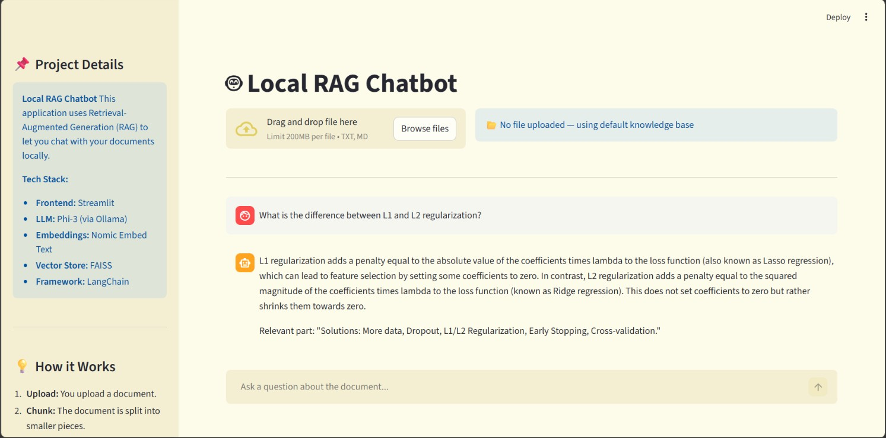
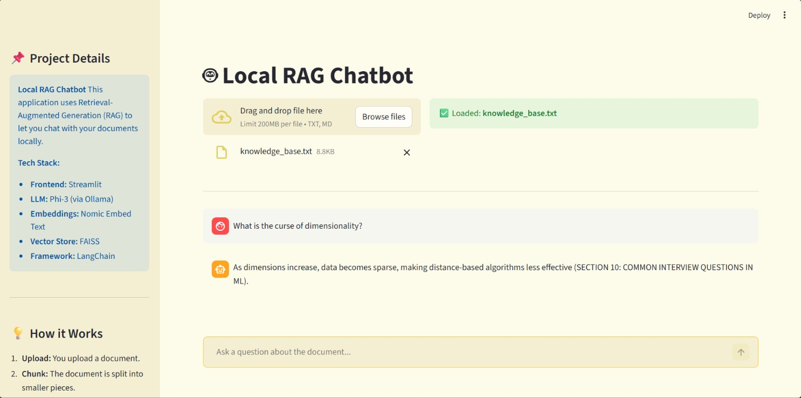
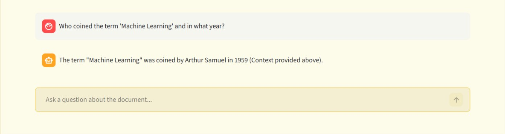
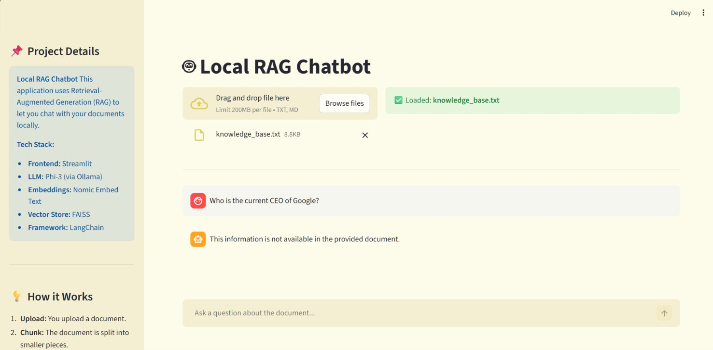
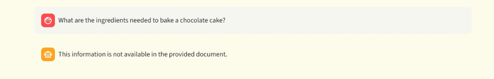

# Q&A Output Log — RAG Chatbot Test Results

This file documents all 5 test questions run against the Local RAG Chatbot, along with screenshots of the responses.

**Document used:** `knowledge_base.txt` — Machine Learning Complete Reference Guide  
**Model:** Phi-3 (via Ollama)  
**Embeddings:** nomic-embed-text  

---

## ✅ In-Document Questions

These questions have answers inside the knowledge base. The chatbot should answer them clearly and cite the context.

---

### Q1 — What is the difference between L1 and L2 regularization?

---

### Q2 — What is the curse of dimensionality?

---

### Q3 — Who coined the term 'Machine Learning' and in what year?

---

## 🚫 Out-of-Scope Questions

These questions have NO answers in the knowledge base. The chatbot should refuse to answer rather than hallucinate.

---

### Q4 — Who is the current CEO of Google?

---

### Q5 — What are the ingredients needed to bake a chocolate cake?

---

## Summary

| # | Question | Type | Expected Behavior |
|---|----------|------|-------------------|
| 1 | What is the difference between L1 and L2 regularization? | ✅ In-Document | Answered from doc |
| 2 | What is the curse of dimensionality? | ✅ In-Document | Answered from doc |
| 3 | Who coined the term 'Machine Learning' and in what year? | ✅ In-Document | Answered from doc |
| 4 | Who is the current CEO of Google? | 🚫 Out-of-Scope | Refused to answer |
| 5 | What are the ingredients to bake a chocolate cake? | 🚫 Out-of-Scope | Refused to answer |
